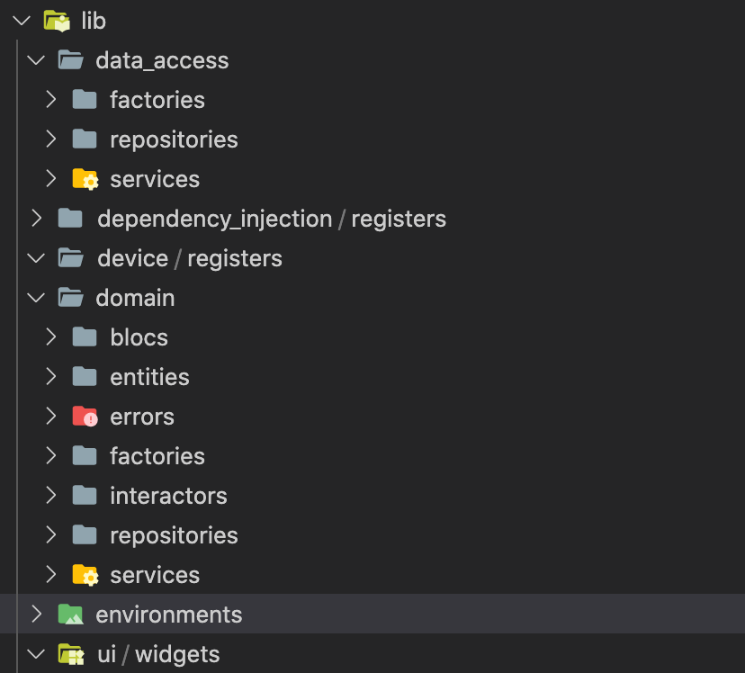

# A Fast.cli plugin to implement clean architecture with bloc in Flutter

## How to install Fast.cli

[Instructions](https://github.com/pbissonho/fast.cli)

## How to install clean-bloc

Add this plugin and start using it with just one command.

```bash 
$ fast plugin add git git@github.com:alfredobs97/clean-bloc.git 
```

## Create directories and add dependencies

```bash
$ clean-bloc create --name <flutter_projet_name> --scaffold bloc
```

This command will create a clean-architecture proyect:



With follow dependencies:

  - flutter_bloc: ^6.0.5
  - freezed_annotation: ^0.12.0
  - logger: ^0.9.4
  - json_annotation: ^3.0.1
  - chopper: ^3.0.2
  - injector: ^1.0.9
  - build_runner: ^1.10.4
  - freezed: ^0.12.2
  - bloc_test: ^7.1.0
  - mockito: ^4.1.3
  - json_serializable: ^3.5.0
  - chopper_generator: ^3.0.6
